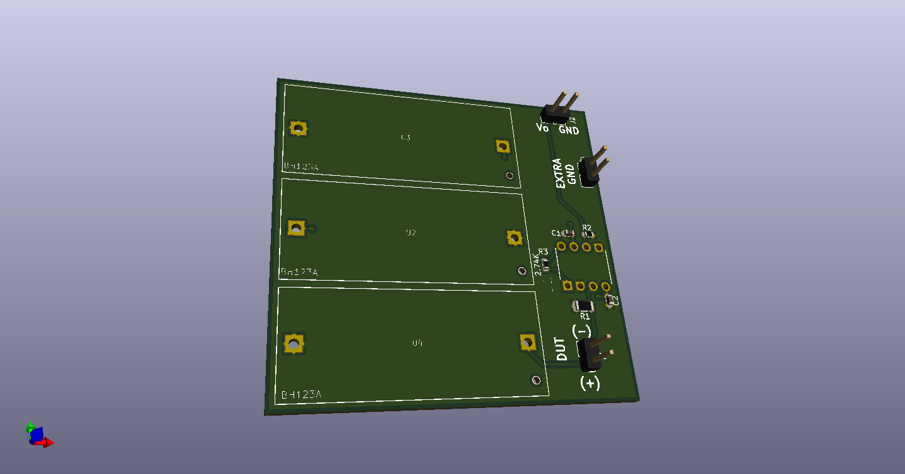

# Current monitor

## Description

This project implements a simple current sensor to measure the current draw of
some low power sensor nodes. The devices can be hooked up to an oscilloscope
and the current draw recorded to get another window into the device operation
over time.

The batteries required are 3V CR123A batteries.

The DUT current draw range should be less than or equal to about 30mV.  The
intention is to watch the current draw using a Siglent SDS1202X-E with the
vertical axis set to 100 mV/div. The expected max Vo is 687.69mV which is
almost all of the screen size of 772mV to minimize quantization error in the
oscilloscope.

## Implementation

The design was described using Skidl and pcb designed using Kicad:

https://github.com/xesscorp/skidl

## Build Instructions

Skidl is required:

```bash
pip3 install skidl
```

To rebuild the netlist for importing into pcbnew:

```bash
./scope-current-shunt.py
```

Open the file scope-current-shunt.kicad_pcb in pcbnew to edit the pcb.

## Render



## Attributions

Some symbols and footprints  came from www.snapeda.com. See the library folder for the required
license and attributions.
